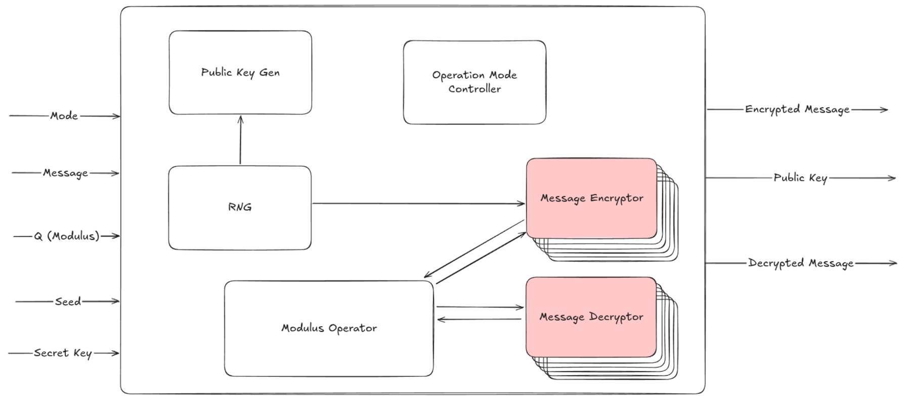
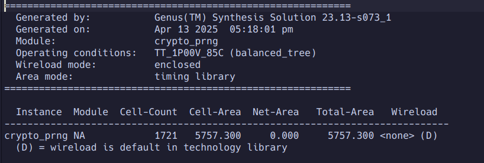

# LWE-Encryption-Accelerator
In Silicon Post-Quantum Encryption Accelerator based on Learning with Errors

## Introduction
Asymmetric encryption is an essential technology in today's hyperconnected society. We rely on asymmetric encryption schemes to secure our communications every day. We also rely on asymmetric encryption in cutting edge finance tech as it fundamentally enables authenticating transactions on the blockchain. Current asymmetric encryption schemes are vulnerable to attacks from quantum computers via Shor's Algorithm. The theory for this algorithm has existed for quite a while now, but no quantum computer sufficiently capable of utilizing the algorithm at production scale has yet to be constructed. Regardless, it is important that we ensure that our encryption schemes are quantum computer resistant since encrypted data can be collected today and stored until sufficient compute resources exist to decrypt the data. As such, many so called "post-quantum" encryption schemes have been invented and even implemented in production.

The extreme frequency at which today's large data centers compute asymmetric encryption kernels combined with the computational complexity of said kernels establish a great need for hardware accelerators for this task. By moving these kernels to dedicated hardware, we have been able to slash power consumption and computation time required for encryption workloads.

As we begin to migrate towards post-quantum encryption schemes, new accelerator architecture will need to be developed to support said schemes. Several published papers have recognized this need and have demonstrated significant speed-ups by deploying to FPGA's, but to the author's best knowledge, the field has yet to explore the potential for speed-ups and efficiency boosts from implementing these accelerators in silicon. This work aims to evaluate silicon implementations of lattice based encrytion schemes.

## Implementation
### Top Level Diagram

The top level design attempts to take advantage of redundancy in order to reduce silicon area cost. Since both encryption and decryption modes require an efficient modulus operator, the block is implemented one and interfaces with circuitry for each mode. Message encryption and public key-gen also both require a stream of random input bits. For this reason the random number generator is also implemented once and interfaces with the key-gen and encryption circuitry.

Aside from this, operation mode controller handles propagating control signals throughout the system in order to ensure shared blocks are properly coordinated with the rest of the chip.

### Encryption Mode

When encrypting a message using the learning with errors method, the circuit needs to generate a new matrix row using the public key matrix rows. To do this, it generates a vector of random coefficients using a random number generator, then computes the sum of each row of the public key matrix multiplied by the corresponding random coefficient. The message bit is then added to the newly constructed equation's sum after passing through the mod operator.

### Decryption Mode

When decrypting a message, the circuit computes the dot product of the encrypted message (which is in the form of a row vector) with the private key (which is in the form of a column vector and is the true solution to the public system of equations). The difference between the provided sum and the real sum is calculated and compared to (Q/2) which gives us the plain-text bit.

### Public Key Generation

In order to generate a public key, an entire matrix of equations must be generated from a randomly generated solution vector. Once a true system of equations has been randomly generated, noise is sampled and added to the last column in the matrix. The modulus operator is then applied to the last column in the matrix and the public key has been generated.

### Modulus Operator

The modulus operator is an essential block in this system. This block is used in more than one operating mode, and thus it is implemented once and re-used in order to save silicon area. The mod operator is implemented as a state machine also to save silicon area. Implementing as a state machine means that more clock cycles will increase linearly as a function of the bit length difference between the operands [1].

This block was synthesized using 45nm standard cells (no CTS) and was found to have the following properties.

The block achieves a power consumption of 33mW. This contributes to a significant reduction in the power required to encrypt a message, as well as decrypt a message.

The modulus operator block only consumes ~2500uM^2 of silicon area.

### Unique Vector Generator
The unique vector generator block takes in a stream of random bits from the random number generator and collects them to use as the coefficients for constructing a new equation from the public matrix. In order to do this, four MLA streams multiply by random coefficients and accumulate, eventually resulting in our randomly constructed equation and sum.

This block was synthesized using 45nm standard cells (no CTS) and was found to have the following properties.

We notice that this block consumes a total of 57mW of power which contributes to a significant reduction in the power consumed when encrypting messages as compared to a resource constrained CPU such as in [3]. The 57mW used by the MLA along with the 32mW of power used by the mod operator represents roughly 2x less instantaneous power consumption for the encryption workload. This, combined with the ASIC's computional speedup means even further energy efficiency than the CPU.
 

The area of this block is rather small, being about the same size as an IO pad for this process.

### PRNG
The PRNG is essential to many operations in the overall system. The PRNG works by incrementing a large counter and running AES symmetric encryption on the counter value. Using Cadence Genus, the block was synthesized to 45nm standard cells. The results of this pre CTS synthesis can be found below.

The PRNG consumes about the same amount of power as the MLA unit at 58mW.

The PRNG is the largest block in the circuit (still not much bigger than a wire bonded IO pad). It consumes ~5800uM^2

## Conclusions
The encryption, decryption, and public key generation kernels are widely deployed in datacenters, on edge devices, etc. Their costly computational demands make them a perfect candidate for efficiency boost via custom silicon. This work demonstrates the strong potential for post-quantum encryption accelerators to provide not only speedups but also significant energy efficiency improvements as compared to CPU's. Furthermore, these results were achieved using an inexpensive 45nm process node, yet was benchmarked against much newer embedded CPU's built on technologies closer to the leading edge. The reasonable size of this system could also potentially enable it to be included alongside an embedded processor in an edge device without drastically raising costs or draining battery life.

Feeding these results to ChatGPT O3 and requesting back of the envelope calculations to estimate the final efficiency gains from the custom silicon implementation (also accounting for some blocks that weren't synthesized in this work) return the following estimates:
Energy per operation -> ~60x lower than CPU
Speed up (Kyber) -> ~22x faster than CPU

Based on these results, it is certainly worth considering fully implementing this hardware and potentially building in some interoperability with other post-quantum encryption methods (this work focused solely on Kyber). It is certainly safe to say that deploying custom silicon for this workload could result in drastic time and energy savings in any setting.

## References
[1] https://arxiv.org/pdf/2407.12541

[2] https://cics.mit.edu/wp-content/uploads/2019/11/Utsav-Banerjee-An-Energy-Efficient-Configurable-Crypto-Processor-for-Post-Quantum-Lattice-based-Protocols.pdf

[3] https://eprint.iacr.org/2023/506.pdf

[4] https://www.youtube.com/watch?v=RprEgcwiCFc

[5] https://www.youtube.com/watch?v=K026C5YaB3A